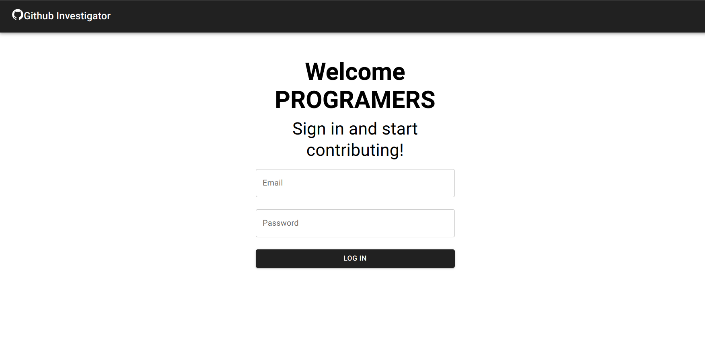
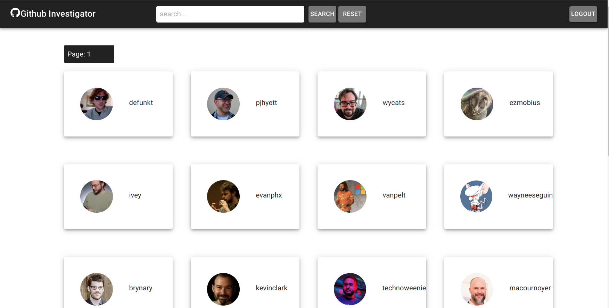
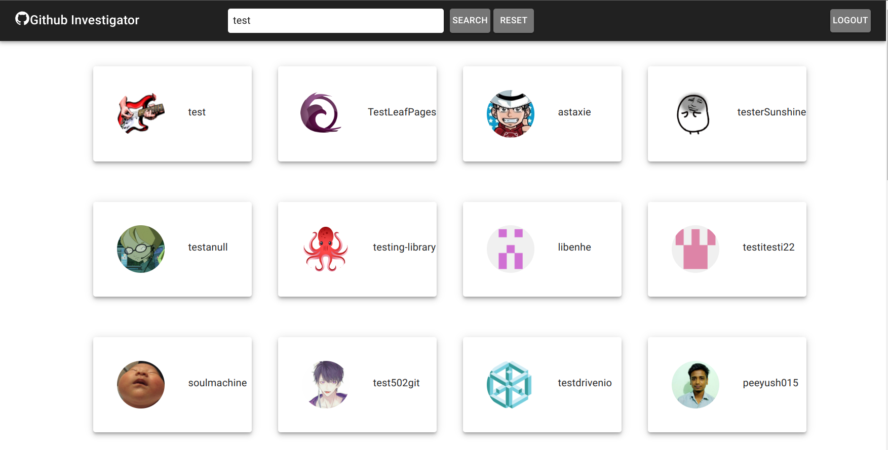
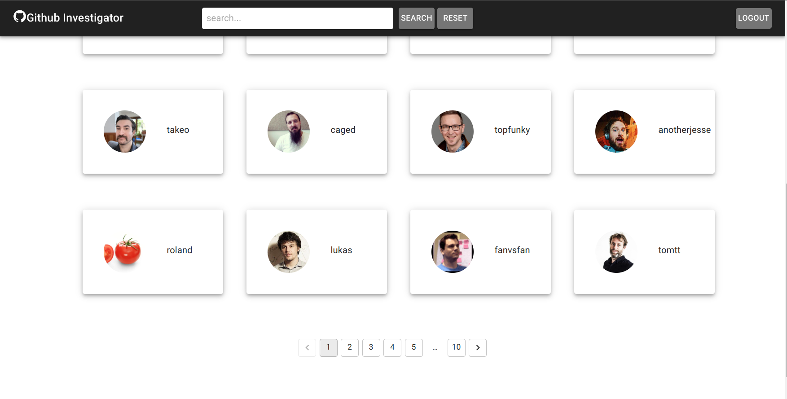
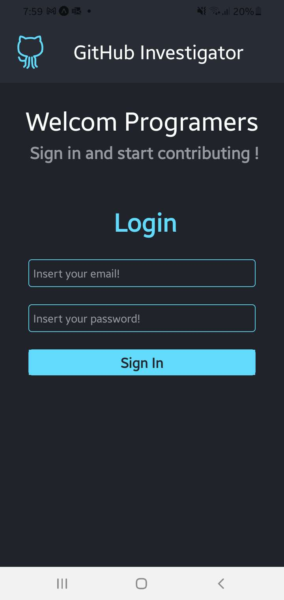
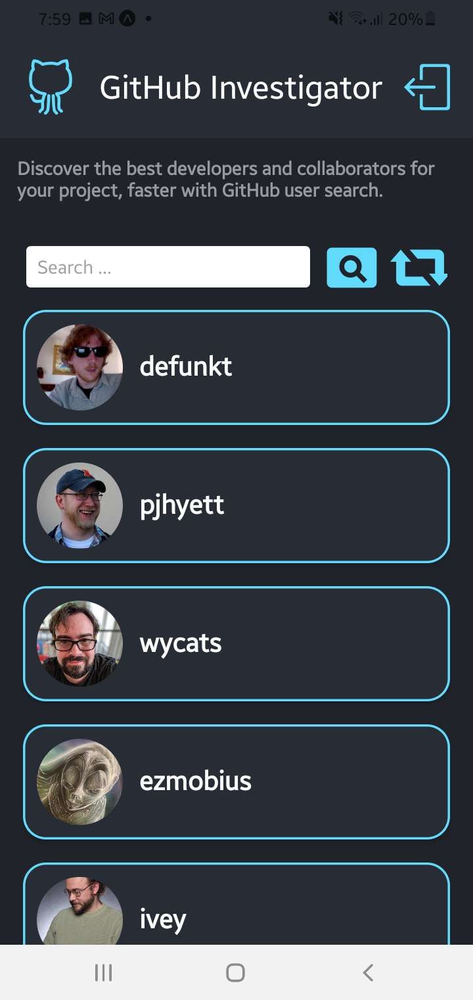
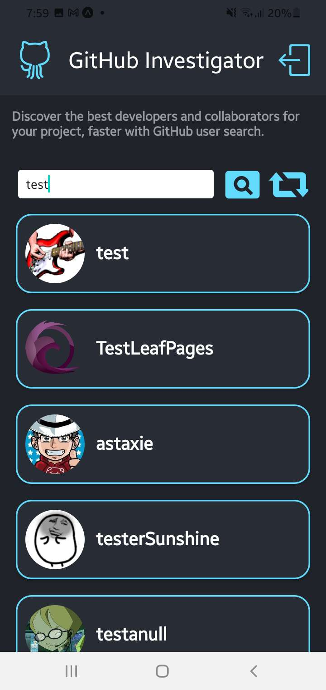

# GitHub Investigator

GitHub Investigator is a project that allows users to search for GitHub users. The project is divided into two sections: a web app and a mobile app. 
## Screenshots

Here are some screenshots of the web and mobile apps:

### Web App

 

 

 

 

### Mobile App

 

  

 

  

 

 

## Web App

The web app is built using React, Redux Toolkit, Material UI, and TypeScript. To run the web app, follow these steps:
# Frontend

1. Clone the repository
2. Navigate to: `cd web-front-back/frontend`
3. Install the dependencies: `npm install`
4. Start the development server: `npm run dev`

# Backend

1. Clone the repository
2. Navigate to: `cd web-front-back/backend`
3. Install the dependencies: `npm install`
4. Start the development server: `npm start`

## React-native App

The mobile app is built using React Native, Redux Toolkit, React Navigation, and TypeScript:

1. Clone the repository
2. Navigate to: `cd /AST-LB-Assestment-React-Native`
3. Install the dependencies: `npm install`
4. Start the development server: `npm start`
5. Navigate to: `cd /AST-LB-Assestment-React-Native/src/features/Auth/AuthService.ts`
6. In line 6 Change (API_URL) to your Ip address.

## Screenshots

Here are some screenshots of the web and mobile apps:

### Web App

 

 

 

 

### Mobile App

 

  

 

  

 

 

# Thank you for checking out GitHub Investigator! If you have any questions or feedback, please don't hesit.
